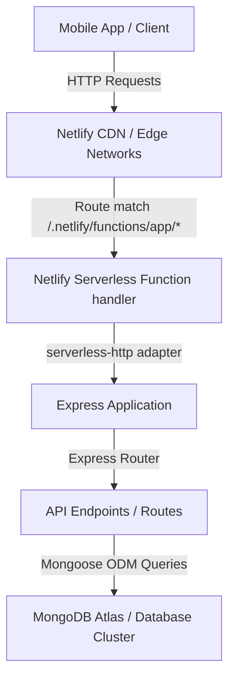

# System Architecture & Design

This document details the system design, architecture, and technology choices behind the **LetsRead API Server**.

---

## 🏗️ High-Level Architecture

The API Server is designed around a **Serverless Function architecture** deployed on Netlify. It wraps a standard Node.js Express framework application, allowing developer-friendly routing and request handling while benefiting from the scalability and reduced overhead of serverless computing.

Here is a visual map of the data flow and system integration:

---

## 🧩 Key Components

### 1. Client Layer
The client layer consists of the LetsRead mobile application (or any client calling the backend). It communicates over standard HTTPS with the API endpoints.

### 2. Entry Point & Adapter (`netlify.toml` & `serverless-http`)
- **`netlify.toml`**: Configures Netlify to look for serverless function entry points inside the `/functions` directory.
- **`serverless-http`**: Acts as a bridge between Netlify's serverless handler signature (`event`, `context`) and the Node.js Express request/response pipeline. It translates incoming AWS Lambda-style requests into standard Node `IncomingMessage` objects and returns the response as a stringified API Gateway payload.

### 3. Application Layer (`functions/app.js`)
A standard Node.js Express application containing:
- **Middleware**: CORS setup and JSON body parsing.
- **Routing**: Router matching requests like `/auth/login`, `/auth/register`, `/books/top`, and `/books/recent`.
- **Database Connection**: Establishes a persistent connection via Mongoose using the connection pooling settings.

### 4. Persistence Layer (`models/` & MongoDB)
- **Mongoose ODM**: Handles schema definitions, object modeling, and validation.
- **MongoDB Atlas**: Serves as the document database, housing JSON collections for `users` and `books`.

---

## ⚡ Serverless Optimization and Lifecycle

Because this application runs on serverless functions, developers must be mindful of the function lifecycle:

### Database Connection Re-use
Normally, serverless functions run in ephemeral containers. Creating a new database connection on every single request introduces severe latency.
- In `functions/app.js`, Mongoose initializes the connection outside the handler scope.
- Subsequent invocations re-use the pre-warmed container instance, keeping the connection cache active.
- Connections will occasionally be closed when the container is recycled (idle timeout). Mongoose is configured with `useUnifiedTopology: true` and automatic reconnection to handle these situations gracefully.

### Cold Starts
The first request after a period of inactivity may experience a slight delay (typically 1-3 seconds) as Netlify spins up a new server container and establishes a connection to MongoDB Atlas. Subsequent requests will execute in milliseconds.
