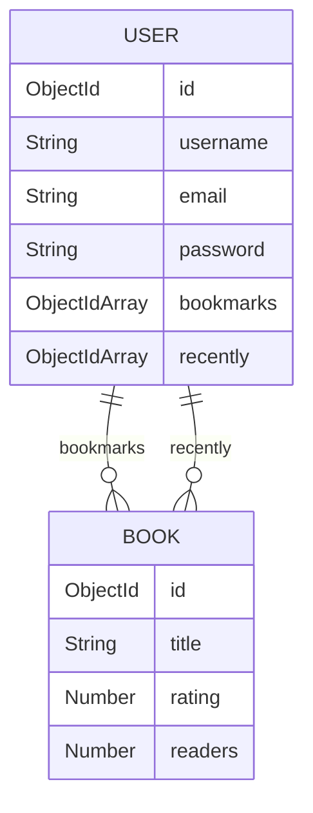

# Database Documentation & Schemas

The application uses **MongoDB** as its primary data store, managed through the **Mongoose ODM** (Object Document Mapper) in Node.js.

---

## 🗄️ Database Connection

The connection is configured via `MONGO_URI` in `.env`. Connection setup parameters:
- `useNewUrlParser: true`
- `useUnifiedTopology: true`

Connections are established outside the function handler loop to ensure container reuse and connection caching.

---

## 📊 Collections & Schemas

### 1. `users` Collection
Stores user profile information, credentials, and user catalog associations (bookmarks and recently read history).

#### Schema Definition (`models/User.js`):
| Field | Type | Required | Unique | Default / Notes |
|-------|------|----------|--------|-----------------|
| `_id` | `ObjectId` | Auto | Yes | MongoDB unique identifier |
| `username` | `String` | Yes | Yes | Trimmed |
| `email` | `String` | Yes | Yes | Lowercased |
| `password` | `String` | Yes | No | *Current status: Plain text. See Authentication Guide.* |
| `fullName` | `String` | No | No | Trimmed |
| `profilePicture`| `String` | No | No | `'https://dummyimage.com/100x100/000/fff&text=User'` |
| `bio` | `String` | No | No | Max length 500 characters |
| `bookmarks` | `[ObjectId]` | No | No | References `Book` model |
| `recently` | `[ObjectId]` | No | No | References `Book` model |
| `createdAt` | `Date` | Yes | No | `Date.now` |

---

### 2. `books` Collection
Stores metadata about the books in the system catalog.

#### Schema Definition (`models/Book.js`):
| Field | Type | Required | Unique | Notes |
|-------|------|----------|--------|-------|
| `_id` | `ObjectId` | Auto | Yes | MongoDB unique identifier |
| `title` | `String` | No | No | Title of the book |
| `cover` | `String` | No | No | URL to cover image |
| `banner` | `String` | No | No | URL to wide banner image |
| `rating` | `Number` | No | No | Rating from 0 to 5 |
| `readers` | `Number` | No | No | Number of active/total readers |
| `genres` | `[String]` | No | No | Array of category names (e.g., `["Classic", "Fiction"]`) |
| `chapters` | `Number` | No | No | Number of chapters |

---

## 🔗 Relationships

The schema models associations using document references:



- **Bookmarks:** References multiple `Book` IDs that the user has saved.
- **Recently Read:** References multiple `Book` IDs that the user has recently read.

To retrieve populated book items in Express queries:
```javascript
const user = await User.findById(userId).populate('bookmarks').populate('recently');
```

---

## ⚙️ Indexing Strategy

To maintain query performance, especially under load, the following indexes are configured or recommended:

### Automatic Indexes
- `users._id` (Default)
- `users.username` (Unique index)
- `users.email` (Unique index)
- `books._id` (Default)

### Recommended Production Indexes
For catalog retrieval optimizations, consider creating compound or single-field indexes:
- **Top Books Index:** `{ rating: -1 }` (Speeds up `router.get('/books/top')`)
- **Recent Books Index:** `{ readers: -1 }` (Speeds up `router.get('/books/recent')`)

---

## 🌱 Seeding Script (`seed.js`)
To reset and re-populate your database with dummy content:
1. Run `node seed.js`.
2. This script writes sample books (like *The Great Gatsby*, *To Kill a Mockingbird*) and sample users (like `john_doe`, `jane_doe`) to the database.
3. *Note:* Make sure to edit the comments inside `seed.js` if you want to clear existing data before writing new seed entries (i.e. uncomment `await Book.deleteMany()` and `await User.deleteMany()`).
